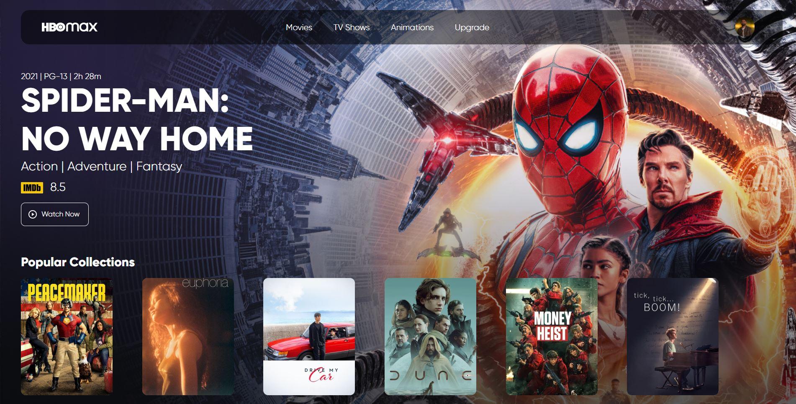

<h1 align="center">
  HBO Max Redesign
</h1>

  

  

## 🚀 Tecnologias

Esse projeto foi desenvolvido com as seguintes tecnologias:

- HTML
- CSS

## 🚧 Projeto

Live Preview: hbo-max-redesign-j623ob0ig-victorrootgtr.vercel.app

## 🎨 Inspiração:

Figma: https://www.figma.com/file/9e1Hid6tWjrnVemRImTdrY/HBO-Max-Redesign-Web-App-(Community)

## :memo: Licença

Esse projeto está sob a licença MIT. Veja o arquivo [LICENSE](LICENSE) para mais detalhes.

---